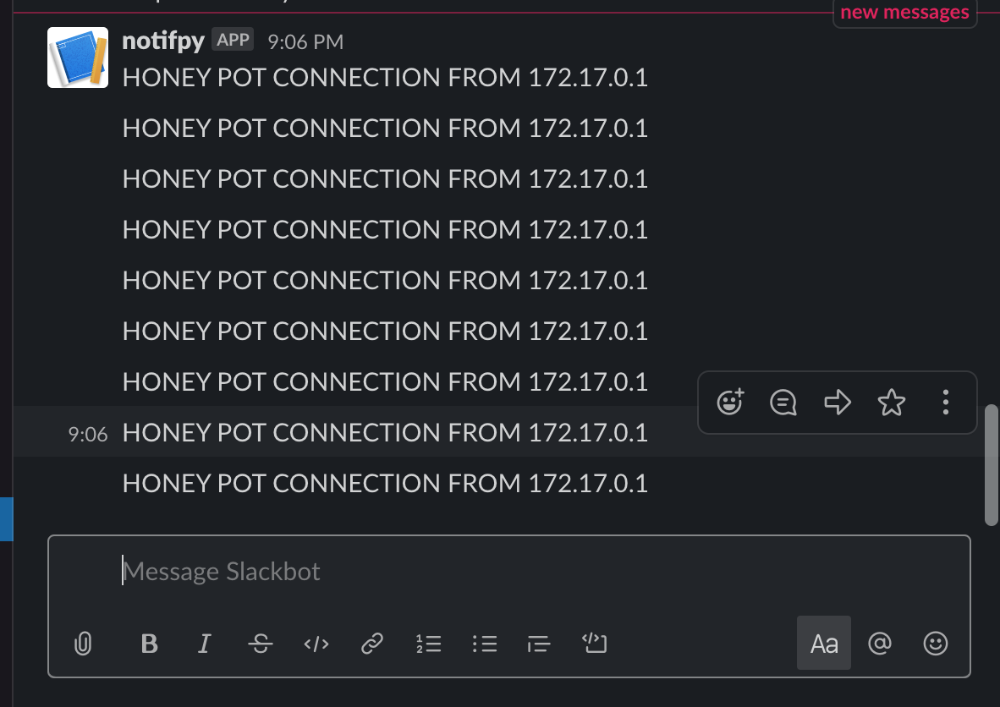

# Introduction

The following report has three sections each describing an ADS associated with the given system. I break down each strategy using the framework published by Palantir (https://github.com/palantir/alerting-detection-strategy-framework). 

Note, I have implemented the strategy for the first section on Linux servers and have included the relevant code.

# Linux Server

For Linux, we will use a honeypot based ADS. Honeypots are intentionally vulnerable systems that lure attackers to connect. Since the organization uses containerization, I will make the assumption that the Linux servers are used to host containers running a variety of applications. We can design a honeypot container in this scenario and monitor for malicious lateral movement.

This strategy can have a strong signal to noise ratio because there should be no legitimate use case to connect to the honeypot container. Ergo, any connection can be seen as malicious.


## Goal

Discover malicious lateral movement via ssh on a network.

## Categorization

Lateral Movement https://attack.mitre.org/tactics/TA0008/

## Strategy Abstract

- Deploy honeypot container running sshd using Docker
- Monitor Docker logs to identify connections
- Issue alert if incoming connection is from a local IP.

## Technical Context

We use the standard [Docker](https://www.docker.com) Ubuntu 16.04 image to run sshd. See the dockerfile included in the Additional Resources section for more details. The Linux server running Docker must also have python3.6+ and pip installed.

The detector.py script runs on the host Linux server to monitor the output from 

    ~> docker logs <container-id\> --follow
    
The python script will send a notification to a specified slack channel with the connecting IP.

For detector.py to work the following packages need to be installed

    ~> pip install slackclient netaddr

## Blind Spots and Assumptions

Assumes the attacker connects to the honeypot which can be avoided if the attacker is sophisticated.

## False Positives

False positives will occur if a host in the local network benignly attempts to ssh into the honeypot. This is unlikely.

## Validation

To validate this strategy deploy the honeypot and connect via ssh. 

In a directory with the dockerfile and detector.py

    ~> docker build -t honey_sshd .
    ~> docker run -d -P --name test_sshd honey_sshd
    ~> python3 detector.py

Then from another shell

    ~> docker port test_sshd 22  # get port to ssh on
    ~> ssh root@localhost -p <port>
    
Then the alert should fire.
    

## Priority

Priority should be high on all alerts

## Response

The following procedure is recommended when this alert occurs:

- Quarantine connecting device for further investigation

## Additional Resources


```python
# detector.py
import sys
import subprocess
import slack
import re
from netaddr import IPNetwork,IPAddress

slack_token = "SLACK_API_TOKEN_HERE"
sc = slack.WebClient(slack_token)
channel = 'SLACK_CHANNEL_HERE'
container = 'CONTAINER_ID_HERE'

ip_pattern = re.compile(r'\b(?:(?:25[0-5]|2[0-4][0-9]|[01]?[0-9][0-9]?)\.){3}(?:25[0-5]|2[0-4][0-9]|[01]?[0-9][0-9]?)\b')
subnet = IPNetwork('172.17.0.0/24')

def notify(message):
    sc.chat_postMessage(channel=channel,text=f'{message}')

def monitor():
    p = subprocess.Popen(['docker','logs',container,'--follow'], stderr=subprocess.PIPE)
    for line in iter(p.stderr.readline,b''):
        line = line.rstrip()
        line = line.decode('utf-8')
        if line:
            ips = re.findall(ip_pattern,line)
            print(ips)
            print(line)
            for ip in ips:
                ip = IPAddress(ip)
                if ip in subnet:
                    msg = f'HONEY POT CONNECTION FROM {ip}'
                    notify(msg)

if __name__ == '__main__':
    monitor()
```


```python
# Dockerfile
FROM ubuntu:16.04

RUN apt-get update && apt-get install -y openssh-server
RUN mkdir /var/run/sshd
RUN echo 'root:pass' | chpasswd
RUN sed -i 's/PermitRootLogin prohibit-password/PermitRootLogin yes/' /etc/ssh/sshd_config

ENV NOTVISIBLE "in users profile"
RUN echo "export VISIBLE=now" >> /etc/profile

EXPOSE 22
CMD ["/usr/sbin/sshd","-D","-e"]
```



# MacOS

For MacOS, we will use a signature based ADS. As malware is discovered and subsequently reverse engineered, system artifacts are often found that make fingerprinting the malicious code easier. These fingerprints, or signatures, can be used to identify infected systems.

Signature based methods have a good signal to noise ratio as long as the signatures are well crafted. On the otherhand, malware that is polymorphic or has not been seen before will be missed by such methods.


## Goal

Identify common attacks associated with MacOS, and alert when matched with osquery's osx-attack pack

## Categorization

Execution https://attack.mitre.org/techniques/T1152/

## Strategy Abstract

- Periodically run the osquery osx-attacks pack on all endpoints
- Send an alert if any signatures are found

## Technical Context

osquery is an open source project by Facebook. (https://osquery.readthedocs.io/en/stable/)
Events include pertinet detail related to the detected signature in JSON format (can be configured).

Events occur if a known indicator (often plist files) are observed.

## Blind Spots and Assumptions

- Assumes osquery is running on the endpoint
- The malware signature is included in the pack
- The events are being reported to SIEM

## False Positives

False positives will occur if a legitmate program has the same file paths, artifacts, etc. included in the attack signature.

## Validation

To validate add a benign plist file to ~/Library/LaunchAgents and use Launchctl to load the plist. For more details see the additional resources below.

## Priority

All alerts should be high priority.

## Response

Follow an infected MacOS playbook. Since the signature is linked to known malware remediation steps should be known as well.

## Additional Resources
https://github.com/palantir/alerting-detection-strategy-framework/blob/master/ADS-Examples/003-osquery-MacOS-Malware-Detection.md

https://osquery.io/

https://github.com/osquery/osquery/blob/master/packs/osx-attacks.conf

# Public Cloud

For the public cloud infrastructure, we will turn to tooling provided by AWS. CloudWatch is a general purpose tool offered by AWS to make monitoring cloud instances simpler. To narrow the scope, we can focus on anomaly detection strategies. CloudWatch has built in Machine Learning capabilities that we can take advantage of to build a detector.

The biggest limitation to this strategy is a high false positive rate. Anomaly detection requires as much art as it does science. This can be mitigated by setting conservative thresholds and focusing only on high impact threats.


## Goal

Discover attempts to exfiltrate data using anomaly detection.

## Categorization

Data exfiltration https://attack.mitre.org/techniques/T1537/

## Strategy Abstract

Train a Machine Learning anomaly detection algorithm (e.g., XGBoost) using labeled data for normal Network IN/OUT data from AWS CloudWatch. We will then use the model to monitor IN/OUT data and classify anomalies. In essence, we are looking for anomalous outbound traffic levels.

## Technical Context

AWS provides the infrastucture to collect metrics on cloud resouces including instance level data of "outbound" traffic. 

A "training" period is required to collect "typical" traffic and build a model using a test set witheld from training. Then the model can be used to preditct anomalies in novel traffic.

Scikit learn is a good option for custom models, but AWS has builtin machine learning capabilities as well.

## Blind Spots and Assumptions

- Assumes training set can be properly labelled
- Assumes malicious anomalies exist

## False Positives

False positives are likely but can be controled by setting a parameter. Classification algorithms can provide a score that can be used for labeling predictions. For example, in Logit models a score can be interpreted as a probability an observation falls into a category. We could use a rule that a score must be above .98 to be labeled as an anomaly.

## Validation

Validation can be difficult if the threshold to alert is high and the cost with moving data out of AWS can be non-trivial. Validation efforts should be focused on validating the model using a cross-validation approach.

## Priority

Multiple thresholds could be used, i.e., a moderate and high severity threshold.

## Response

The instance metrics should be investigated to verify data is not being exfiltrated.

## Additional Resources

https://aws.amazon.com/cloudwatch/getting-started/

